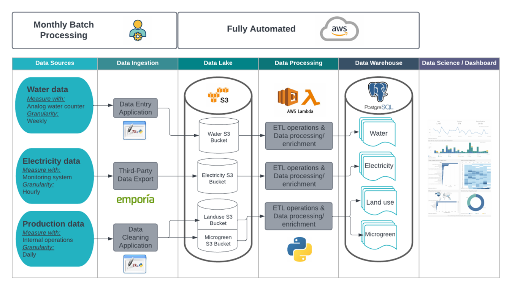

# Environmental Information System - Master Thesis

This repository gives a short overview of the master thesis **Data Driven Sustainability Assessment of Indoor Farming Operations** released in december 2023. The objective of the environmental information system (EIS) is to collect data, store and process, and present the ecological footprint on a dashboard. The Environmental Information System has been designed for a Start-Up company in the Food and Agriculture sector, using indoor vertical farming techniques and were interested in acknowledging their environmental impact. 

|    |      |
|---|---|
|**Environmental Footprint**| Electricity, Water, Land|
|**Data Collected**| Electricity consumption, Water utilization, Food production and Land surface|
|**Collection Method**| Energy monitoring system, Customed data entry application|
|**Database**| AWS: S3 and PostgresSQL(RDS)|
|**ETL pipelines**| AWS: lambda function (Python)|
|**Dashboard**| Tableau software|

> Note: To avoid any conflict or leak of confidential information, no code, files or number are disclosed here, meaning I cannot present the final product, contact me for more information.

The Information System is divided in 3 parts *1) Data Acquisition* *2) Data Hosting and Processing* *3) Data Visualization*. 

